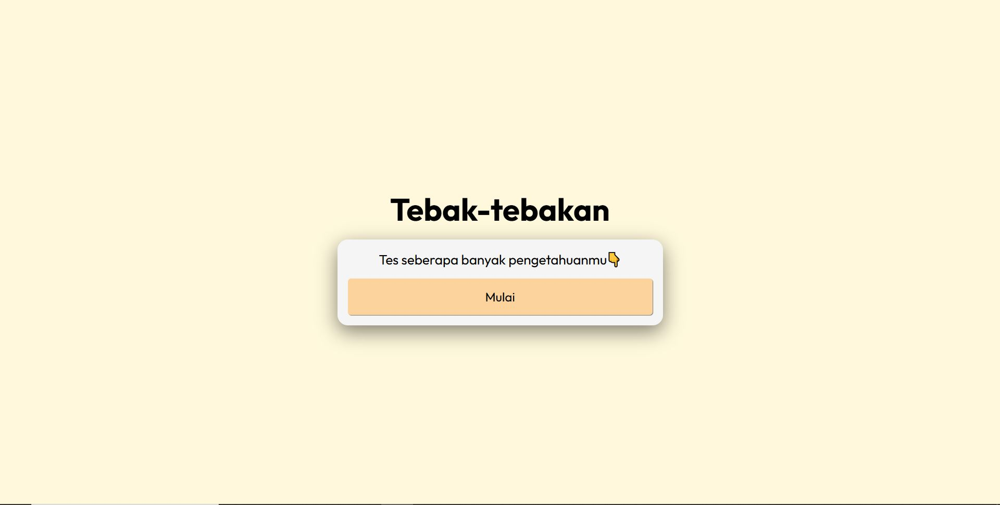
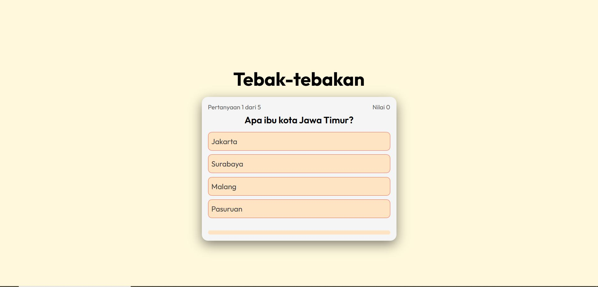
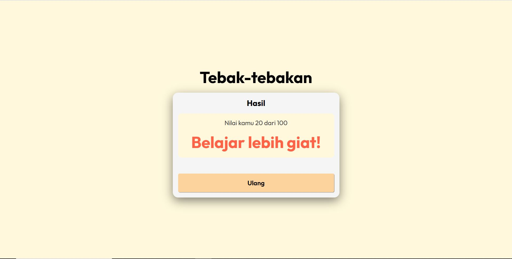

# 🧠 Tebak-Tebakan Web App

Ini adalah proyek web sederhana **Tebak-Tebakan** yang dibuat menggunakan **HTML, CSS, dan JavaScript tanpa framework**. Aplikasi ini menampilkan pertanyaan pilihan ganda dan menghitung skor berdasarkan jawaban yang benar.

## 🎮 Fitur

- Pertanyaan pilihan ganda
- Feedback langsung setelah memilih jawaban
- Skor otomatis
- Progress bar
- Tombol restart untuk mengulang permainan

## 📷 Screenshot

  

## 🚀 Cara Menjalankan

buka url ini : https://game-tebak-tebakan.vercel.app/